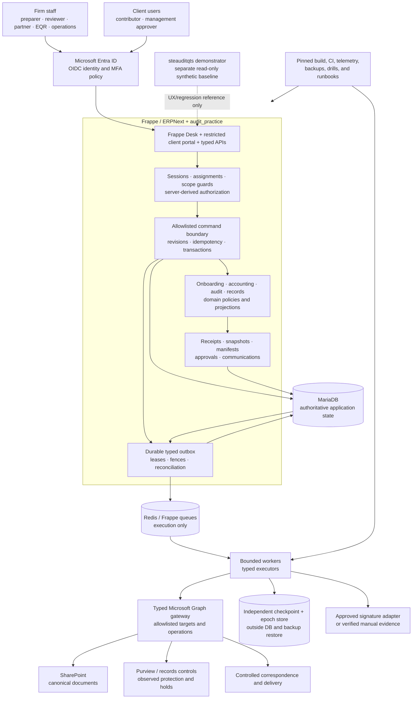
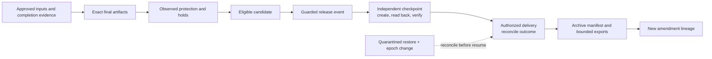

# STE AuditSphere Ops architecture

This is the target-state organization guide for `nirzaf/steauditsphereops`, derived from the supplied `AuditSphereOps_PROJECT_STRUCTURE.md` and reconciled with the repository WBS and agent contract.

> [!IMPORTANT]
> This document describes architecture and ownership. It is not evidence that the application, dependencies, providers, credentials, acceptance tests, or deployment exist. Paths marked as planned are created only by their owning WBS task.

## 1. Architecture decision

Use one production repository containing one Frappe custom app, organized as a Frappe-native modular monolith with capability-oriented Python packages.

The production app remains:

```text
production/audit_practice/
└── audit_practice/       # importable Python package
    └── audit_operations/ # Frappe module and DocTypes
```

The platform boundary is fixed by the WBS:

- Frappe/ERPNext provides the application and firm-facing platform.
- MariaDB owns structured workflow state, history, revisions, generations, and durable outbox intent.
- Redis and Frappe workers execute bounded typed operations; Redis is not business truth.
- Microsoft Entra provides verified identity and session lifecycle.
- Microsoft Graph is reached through an allowlisted typed gateway.
- SharePoint stores canonical working and issued documents.
- Observed records protection and legal holds govern retained evidence.
- An independently administered checkpoint and recovery epoch protect release operations across restore.

The architecture does not add an initial FastAPI service, Kafka, a generic workflow engine, a replacement DMS, a duplicate global store, a .NET rewrite, or a fork of Frappe/ERPNext. Optional signature, screening, and analytics integrations require an approved capability, license, and manual fallback disposition. The independent checkpoint and recovery-epoch provider is mandatory for release and recovery; release remains blocked until it is independently verified.

Task 01 retains an unresolved mapping from the inherited `steauditqts` execution reference to this repository. That owner-approved mapping must be recorded before task 01 acceptance; the demonstrator must not be copied or silently converted into the production application.

## 2. System context



The demonstrator is a separate, synthetic-state Vue/Vite/Cloudflare reference. It is not the production identity, persistence, evidence, approval, or release authority.

## 3. Repository-level layout

The following is the planned repository shape. `...` means task-owned entries omitted for readability; it is not permission to scaffold unspecified files.

```text
steauditsphereops/
├── README.md
├── ARCHITECTURE.md
├── AGENTS.md
├── SYSTEM_PROMPT.md                  # workspace-local agent context; not a production artifact
├── CODEOWNERS                         # only when governance creates it
├── CONTRIBUTING.md                    # only when governance creates it
├── cubic.yaml                         # only when governance creates it
├── .github/
│   └── workflows/
│       └── production-ci.yml          # WBS 09, not assumed present
│
├── docs/
│   ├── 01-execution-contract-and-baseline.md
│   ├── 02-business-contracts-and-operating-targets.md
│   ├── ...
│   ├── 72-controlled-production-rollout-and-handover.md
│   └── production/
│       ├── source-baseline.md
│       ├── execution-status.json
│       ├── decision-register.md
│       ├── service-profiles.json
│       ├── gate-contracts.json
│       ├── output-catalog.json
│       ├── nfr-targets.json
│       ├── requirement-traceability.json
│       └── ...
│
├── production/
│   └── audit_practice/                # installable custom app
├── infra/
│   └── production/                    # exact pins, environments, packaging
├── scripts/
│   ├── wbs/                           # stdlib-only validators
│   ├── p0/                            # disposable feasibility proofs
│   └── production/                    # thin guarded operator/test wrappers
├── fixtures/                          # approved synthetic reference inputs
├── tests/
│   └── production/                    # browser/system acceptance tests
├── playwright.production.config.js   # WBS 33 target, when created
└── .local/                            # ignored Bench/checkouts/scratch
```

Never commit Bench/vendor trees, `sites/`, runtime secrets, `node_modules`, private evidence, client attachments, or copied demonstrator state.

### Repository root is not the Bench root

```text
REPO_ROOT  = steauditsphereops/
APP_ROOT   = REPO_ROOT/production/audit_practice/
PY_ROOT    = APP_ROOT/audit_practice/
BENCH_ROOT = ignored disposable Bench managed by scripts/production/dev
```

Frappe must be proven to mount or install `APP_ROOT` into the ignored Bench. The repository root is not assumed to be a Bench or directly installable app root.

## 4. Production app layout

All paths below are under `production/audit_practice/`. Frappe metadata, controllers, and package initialization stay together. Capability packages are ordinary Python packages; they are not separately deployed services or Frappe apps.

```text
production/audit_practice/
├── pyproject.toml                     # task-03-approved dependencies
└── audit_practice/
    ├── __init__.py
    ├── hooks.py                        # thin lifecycle/permission/job wiring
    ├── modules.txt                     # Audit Operations module
    ├── patches.txt                     # ordered migration registrations
    │
    ├── audit_operations/               # Frappe metadata and local invariants
    │   ├── doctype/
    │   │   ├── audit_engagement/
    │   │   │   ├── audit_engagement.json
    │   │   │   └── audit_engagement.py
    │   │   ├── audit_assignment/
    │   │   ├── audit_scope_guard/
    │   │   ├── audit_document_receipt/
    │   │   ├── audit_snapshot/
    │   │   ├── audit_approval_decision/
    │   │   ├── audit_release_event/
    │   │   └── ...                     # exact WBS-owned DocTypes
    │   └── page/audit_workspace/
    │
    ├── api/                            # thin request/response adapters
    │   ├── session.py
    │   ├── clients.py
    │   ├── commercial.py
    │   ├── activation.py
    │   ├── pbc.py
    │   ├── evidence.py
    │   ├── accounting.py
    │   ├── audit.py
    │   ├── reviews.py
    │   ├── approvals.py
    │   ├── records.py
    │   ├── communications.py
    │   ├── artifacts.py
    │   ├── workspace.py
    │   └── errors.py
    │
    ├── application/                    # commands and shared workflows
    │   ├── commands.py                 # authenticated allowlisted entry point
    │   ├── transactions.py             # unit of work, locks, revisions
    │   ├── command_registry.py         # explicit command composition
    │   ├── digests.py                  # request digest and replay identity
    │   ├── gate_registry.py            # implemented gate providers only
    │   ├── projections.py              # scoped workspace/next-action views
    │   ├── approvals.py
    │   ├── impact.py
    │   ├── evidence.py
    │   ├── onboarding.py
    │   ├── commercial.py
    │   ├── terms.py
    │   ├── activation.py
    │   ├── pbc.py
    │   ├── communications.py
    │   ├── notifications.py
    │   ├── artifacts.py
    │   ├── signatures.py
    │   ├── handoffs.py
    │   ├── time_and_cost.py
    │   ├── billing.py
    │   └── continuance.py
    │
    ├── domain/                         # pure policies, values, canonicalization
    │   ├── acceptance.py
    │   ├── approval_policy.py
    │   ├── commercial.py
    │   ├── gates.py
    │   ├── manifests.py
    │   ├── pbc.py
    │   ├── references.py
    │   └── release_policy.py
    │
    ├── accounting/                     # client-accounting capability
    │   ├── parsers.py
    │   ├── imports.py
    │   ├── validation.py
    │   ├── mapping.py
    │   ├── bridges.py
    │   ├── journals.py
    │   ├── plans.py
    │   ├── decimal_policy.py
    │   ├── schedules.py
    │   ├── comparatives.py
    │   ├── disclosures.py
    │   ├── statements.py
    │   └── management.py
    │
    ├── audit/                          # audit execution and review
    │   ├── planning.py
    │   ├── materiality.py
    │   ├── risks.py
    │   ├── populations.py
    │   ├── sampling.py
    │   ├── workpapers.py
    │   ├── summaries.py
    │   ├── reviews.py
    │   ├── findings.py
    │   ├── remediation.py
    │   ├── completion.py
    │   ├── opinions.py
    │   └── internal_audit.py
    │
    ├── records/                        # release/recovery workflow code
    │   ├── holds.py
    │   ├── protection.py
    │   ├── finalization.py
    │   ├── candidates.py
    │   ├── release.py
    │   ├── checkpoint_payload.py
    │   ├── checkpoints.py
    │   ├── epochs.py
    │   ├── delivery.py
    │   ├── delivery_reconciliation.py
    │   ├── archive.py
    │   ├── exports.py
    │   ├── amendments.py
    │   └── recovery.py
    │
    ├── security/                       # identity, scope, protected writes
    │   ├── identity.py
    │   ├── sessions.py
    │   ├── authorization.py
    │   ├── action_policy.py
    │   ├── queries.py
    │   ├── permission_reconciliation.py
    │   ├── protected_document.py
    │   ├── write_context.py
    │   ├── schema_policy.py
    │   └── erpnext_links.py
    │
    ├── integrations/                   # provider adapters only
    │   ├── microsoft/
    │   │   ├── token_provider.py
    │   │   ├── transport.py
    │   │   ├── documents.py
    │   │   ├── delta.py
    │   │   ├── mail.py
    │   │   └── records.py
    │   ├── signatures.py
    │   ├── screening.py
    │   └── checkpoints.py
    │
    ├── jobs/                           # outbox execution mechanics
    │   ├── dispatcher.py
    │   ├── executors.py
    │   ├── leases.py
    │   ├── retry.py
    │   ├── reconciliation.py
    │   └── impact.py
    │
    ├── runtime/                        # settings, errors, clock, telemetry
    │   ├── settings.py
    │   ├── errors.py
    │   ├── logging.py
    │   └── clock.py
    ├── schema/                         # reusable scope/link validation
    ├── patches/                        # additive, registered DB upgrades
    ├── setup/                          # controlled ERPNext custom fields
    ├── fixtures/                       # deployable metadata, never client data
    ├── migration/                      # approved legacy data mapping/import
    ├── www/                            # restricted portal pages
    ├── ui/                             # route/next-action metadata
    ├── public/                         # focused JS/CSS presentation assets
    ├── templates/artifacts/             # approved rendering templates
    └── tests/                          # task-named Frappe test modules
```

`records/` contains release and recovery code, not stored evidence. `audit_operations/doctype/` contains Frappe metadata and local invariants; it does not orchestrate unrelated capabilities or make provider calls during a generic save. `schema/` adds reusable validation but does not create a second schema or ORM.

## 5. Ownership and dependency direction

### Single owner for each kind of logic

| Location | Owns | Must not own |
| --- | --- | --- |
| `api/` | Request shape, transport errors, command/scoped-query calls | Professional decisions, commits, direct Graph calls |
| `application/commands.py`, `transactions.py` | Authentication/authorization entry, replay, revision/lock protocol, transaction completion | Every feature's business rules |
| `application/*.py` | Explicit shared workflows and cross-capability handoffs | Duplicate calculation engines or generic event sourcing |
| `domain/` | Deterministic policies, value types, canonical manifests | Frappe session/DB, HTTP, queues, global clocks |
| `accounting/` | Imports, mappings, reflection, journals, schedules, FS use cases | Posting client-accounting state into the firm ledger as a shortcut |
| `audit/` | Planning, procedures, sampling, workpapers, professional review | Client self-approval or autonomous opinion selection |
| `records/` | Candidates, release, checkpoints, delivery, archive, recovery state | Unrestricted HTTP or mutable issued records |
| `audit_operations/doctype/` | Frappe metadata, record invariants, guarded transitions | Cross-feature orchestration or provider effects in save hooks |
| `schema/` | Reusable link, scope, and schema checks | A parallel schema definition system |
| `security/` | Identity, assignments, scope, protected-write policy | UI-derived authority or caller-supplied privilege overrides |
| `integrations/` | Provider transport and response normalization | Deciding professional release eligibility |
| `jobs/` | Outbox claims, attempts, retries, leases, reconciliation | A second workflow store in Redis |
| `runtime/` | Settings, typed errors, time, safe telemetry | Business entities or a general DI framework |
| `www/`, `public/`, `ui/` | Presentation and interaction | Approvals, authorization, financial calculations |
| `scripts/production/` | Environment guards and operator/test entry points | Alternate release, billing, or migration rules |

### Runtime dependency flow

```text
HTTP / Desk / portal
        |
        v
api/<capability>.py
        |
        v
application/commands.py
        |
        +--> security + idempotency + short transaction
        |
        v
explicit command registry -> capability handler
        |
        +--> domain policies and shared helpers
        +--> Frappe DocTypes / ORM / scoped queries
        +--> history + generations + durable outbox

After commit:
jobs/dispatcher -> typed executor -> provider adapter
                                      |
                                      v
                        checked provider observation
                                      |
                                      v
                         fenced local completion
```

The command boundary is an explicit allowlist, not a command-bus framework. The transaction acquires the documented client-period guard before ordered engagement/record guards and never calls a provider while holding database locks.

### Import rules

1. `domain/` stays framework-, HTTP-, queue-, and feature-orchestrator-free; pass time and policy inputs explicitly.
2. Capability handlers use focused application helpers and scoped persistence; they do not import `api/`, recursively dispatch commands, or register themselves through filesystem scanning.
3. Only composition code registers handlers, gate providers, executors, hooks, and command routes. Missing providers fail closed.
4. Provider adapters return observations and outcomes; they cannot grant approval or mark a release eligible.
5. DocType controllers call reusable schema/security/policy functions; they do not call the command dispatcher recursively.
6. Cross-capability work belongs in explicit coordinators such as `application/handoffs.py`.
7. Runtime code never imports from repository scripts, test fixtures, or the demonstrator.

## 6. Schema, persistence, and release safety

### Canonical ownership

DocType JSON under `audit_operations/doctype/` is the Frappe schema source. Its controller and package initialization stay with the DocType. `schema/` supplies reusable checks; it does not independently generate tables.

Keep these concepts separate:

```text
schema/ + DocType JSON     = data structures and invariants
patches/ + patches.txt    = ordered schema/application upgrades
migration/                = approved legacy-data mapping/import
records/amendments.py     = post-issuance business amendment workflow
```

Use additive migrations by default. Register ordered patches, test fresh install and upgrade paths, and preserve historical patch behavior. A release amendment is not permission to drop tables or rewrite issued records.

### Transaction and evidence invariants

- Commit business state, append-only history, revisions, input/safety generations, command receipts, and outbox intent atomically.
- Bind idempotency to authorized actor, scope, target, action, and canonical request digest; changed payloads conflict.
- Keep original, stored, submitted, signed, protected, and issued byte identities distinct.
- Treat provider timeout-after-success as uncertainty to reconcile, not as permission for a blind duplicate.
- Use exact `Decimal` values and approved rounding; never use cash-flow plugs, invented disclosures, unsafe formula execution, or client TB data as firm-ledger state.
- Preserve historical decisions and issued artifacts; corrections append lineage instead of mutating history.

### Release chain



`records/release.py` owns release authorization, `records/checkpoints.py` owns checkpoint-dependent transitions, `records/delivery.py` owns delivery behavior, and `integrations/microsoft/mail.py` performs approved mail operations without deciding professional eligibility. No direct-send shortcut belongs in an API, form script, export, or generic save hook.

## 7. Frontend organization

Use Frappe Desk for staff workflows and Frappe/Jinja pages with focused JavaScript/CSS for the restricted client portal. The separate Vue/Vite demonstrator remains a reference, not the production authority.

- `audit_operations/page/audit_workspace/` owns the Desk page entry and initial wiring.
- `public/js/*_workspace.js` owns focused capability interaction code.
- `www/audit_portal.py` authorizes and constructs permitted page context; `audit_portal.html` renders it.
- `ui/routes.py` provides server-side route and next-action projections.
- `templates/artifacts/` contains approved templates, not generated customer deliverables.
- Server routes and payload allowlists decide visibility; browser state never becomes authority.
- Do not add a parallel React/Next.js app, global frontend store, bearer-token local storage, or SPA rewrite merely to reorganize files.

Clients see only authorized projections and published deliverables. They do not see internal cost, private review notes, checkpoints, control credentials, or other-client data.

## 8. Testing and fixture ownership

| Test category | Location | Execution context |
| --- | --- | --- |
| P0 capability proofs | `scripts/p0/` | Disposable proof site or explicitly authorized test tenant |
| Python policy/use cases | `production/audit_practice/audit_practice/tests/test_*.py` | Pure tests where possible; Frappe site where required |
| Schema/access/transactions/races | Named app test modules | Real disposable MariaDB/Frappe environment |
| Browser journeys | `tests/production/*.spec.js` | Actual disposable Frappe application |
| Operational drills | `scripts/production/` + task-owned tests | Approved isolated environment |
| WBS validation | `scripts/wbs/` | Python standard library, no business effects |

Keep fixture purposes distinct:

```text
fixtures/                         approved shared synthetic inputs
production/.../fixtures/          deployable Frappe metadata
production/.../tests/fixtures/    test-specific synthetic data
.local/ or restricted storage     runtime output and proof material
```

After WBS 09 creates the wrapper, use only its allowlisted disposable environment:

```bash
./scripts/production/dev doctor
./scripts/production/dev bootstrap-test
./scripts/production/dev migrate-test
./scripts/production/dev test audit_practice.tests.test_bootstrap
./scripts/production/dev build
```

A missing command, zero collected tests, mock, dry run, or skipped live proof is not a pass.

## 9. Agent navigation and change boundaries

### Canonical context sources

| Source | Authority |
| --- | --- |
| [AGENTS.md](AGENTS.md) | Execution, authorization, safety, review, and lifecycle policy |
| `SYSTEM_PROMPT.md` (workspace-local) | Engineering-agent mission, candidate stack, task sequencing, invariants, tests, and evidence handoff |
| `docs/NN-*.md` | Exact task scope, dependencies, target files, and acceptance criteria |
| `docs/production/source-baseline.md` | Approved source and repository/path mapping, when created |
| `docs/production/execution-status.json` | Observable dependency and acceptance evidence, when created |
| `ARCHITECTURE.md` | Target organization and capability ownership |

The user request and owner-approved decisions remain authoritative. Attached/reference documents explain architecture; they do not override the repository contract or authorize deployment, credentials, production writes, or acceptance publication.

### Capability-to-change map

| Change | Main implementation | Focused proof |
| --- | --- | --- |
| Access scope | `security/authorization.py`, `queries.py` | `test_authorization.py` |
| PBC clarification | `application/pbc.py`, `domain/pbc.py`, `api/pbc.py` | `test_pbc.py` |
| TB parsing | `accounting/parsers.py`, `validation.py`, `imports.py` | `test_tb_import.py` |
| Journal reflection | `accounting/bridges.py`, `journals.py` | `test_mapping_and_bridges.py`, `test_journals.py` |
| Workpaper submission | `audit/workpapers.py`, `summaries.py`, `api/audit.py` | `test_workpapers.py` |
| Independent review | `audit/reviews.py`, `application/approvals.py` | `test_reviews.py`, `test_approvals_and_impact.py` |
| Release authorization | `records/release.py`, `domain/release_policy.py`, `api/records.py` | `test_release_authorization.py` |
| Checkpoint/delivery | `records/checkpoints.py`, `delivery.py`, `jobs/executors.py` | `test_checkpoint_gate.py`, `test_delivery.py` |
| Portal presentation | `www/`, `public/js/portal.js`, `ui/routes.py` | `test_portal_routes.py`, `tests/production/portal.spec.js` |

One task, one writer, one owned branch, and the smallest dependency-ready change remain the default. Logical package separation does not authorize parallel WBS execution.

## 10. Scale and configuration

- Use the same pinned app build for web processes and bounded general/processing workers; restrict records workers with separate credentials and execution policy.
- Scale from measured queue age, query time, provider limits, and capacity evidence—not speculative microservices.
- Keep one Frappe site per operating firm initially; ERPNext multi-company is not cross-firm tenant isolation.
- Own compatible platform tags, commits, and image digests in `infra/production/versions.json`.
- Own app dependencies in `production/audit_practice/pyproject.toml` and accepted generated locks.
- Interpret application settings in `audit_practice/runtime/settings.py`.
- Keep runtime secrets in the approved secret store or ignored site configuration; examples contain names, not credentials.
- Select and verify the newest compatible stable releases at WBS 03 or an approved upgrade, then pin and test them. Candidate versions in `SYSTEM_PROMPT.md` are guidance, not an approved lock.

## 11. Creation sequence

| Milestone | WBS tasks | Structure introduced or extended |
| --- | --- | --- |
| R0 | 01–08 | Source/contracts/status, pins, validators, isolated P0 proofs |
| R1 | 09–24 | App skeleton, runtime/security/schema, commands, integrations/jobs, evidence/approval/gates |
| R2 | 25–34 | Onboarding/commercial/PBC workflows, render templates, Desk/portal, browser harness |
| R3 | 35–50 | Accounting, audit execution/review, schema, workspaces |
| R4 | 51–62 | Records/release/checkpoint/delivery/archive/recovery and fault proofs |
| R5 | 63–72 | Billing/continuance, operations, migration, hardening, traceability, pilot, handover |

The structure guide does not mark any task accepted. Each task still requires its declared dependencies, predecessor exit, current-head tests, required reviews, external decisions, and evidence.

## 12. Definition of a maintainable feature change

A maintainable change has one business owner, the minimum necessary schema/controller/API/UI edits, focused regression evidence, and a clear WBS/requirement reference. A rule must not be reimplemented independently in the browser, API, worker, and DocType.

For a release change, begin with WBS 55, `records/release.py`, `domain/release_policy.py`, the release-event controller, and its focused tests. Change shared command machinery only when the feature exposes a verified defect in that machinery.

The goal is predictable locations, explicit dependencies, and a small review surface—not a large number of folders or a framework for its own sake.

## Sources and scope

- Supplied reference: `AuditSphereOps_PROJECT_STRUCTURE.md` (local attachment; proposed organization guide).
- [Repository `AGENTS.md`](AGENTS.md)
- `SYSTEM_PROMPT.md` (workspace-local engineering system prompt)
- [WBS 01 — execution contract and baseline](docs/01-execution-contract-and-baseline.md)
- [WBS 03 — toolchain and version contract](docs/03-toolchain-and-version-contract.md)
- [WBS 09 — production app and test harness](docs/09-production-app-and-test-harness.md)
- [WBS 17 — transactional command kernel](docs/17-transactional-command-kernel.md)
- [WBS 33 — production workspaces and client portal](docs/33-production-workspaces-and-client-portal.md)
- [WBS 35 — accounting data schema](docs/35-accounting-data-schema.md)
- [WBS 55 — guarded release authorization](docs/55-guarded-release-authorization.md)

The supplied guide and this file are organizational references. They do not resolve the source-repository mapping, claim current implementation or compatibility, or authorize credentials, deployment, tenant changes, external sends, or irreversible operations.
