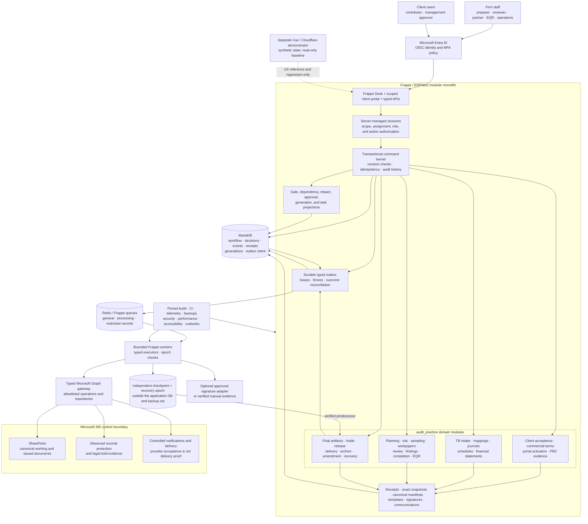
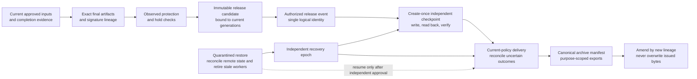

# STE AuditSphere Ops

STE AuditSphere Ops is the controlled build plan for a production audit-practice platform covering client onboarding, evidence collection, accounting, audit execution, review, release, records protection, recovery, and operational handover.

> [!IMPORTANT]
> This repository is primarily a controlled build plan. Besides the specifications, a fast-tracked WBS-09 source scaffold now exists: the `audit_practice` app skeleton, the guarded `scripts/production` harness, the disposable `scripts/p0` proofs and probes, pinned `infra/production` configuration, and a `production-ci.yml` workflow. Only tasks 01–04 are `ACCEPTED` (see [execution status](docs/production/execution-status.json)); task 05 is `BLOCKED`, WBS-09 is not accepted, and no business workflow, identity, accounting, or release capability is implemented. Presence of a file or scaffold does not mean a capability is built, accepted, deployed, licensed, or approved for production use.

## Project objectives

- Provide one authoritative workflow for accounting-only, external-audit-only, combined, and approved internal-audit engagements.
- Keep every client, reporting period, engagement, command, artifact, approval, job, export, and cache inside its authorized scope.
- Bind evidence, reviews, signatures, and professional decisions to exact preserved versions instead of mutable files or dashboard state.
- Make business transitions atomic, revision-checked, idempotent, auditable, and safe under retries, concurrency, provider failures, and restoration.
- Preserve separation of duties between preparers, reviewers, partners, EQRs, records custodians, recovery operators, and technical administrators.
- Produce reproducible financial statements and audit outputs from approved structured inputs, exact arithmetic, pinned templates, and recorded professional authority.
- Prevent delivery until final artifacts are protected, release is authorized, and an independently stored checkpoint is published and verified.
- Deliver measurable security, accessibility, resilience, traceability, migration, pilot, rollout, and handover evidence before production enablement.

The governing execution contract and complete WBS index are in [task 01](docs/01-execution-contract-and-baseline.md). Business profiles, gates, outputs, and unresolved owner decisions are defined by [task 02](docs/02-business-contracts-and-operating-targets.md). Detailed package ownership, import direction, and target paths are documented in [ARCHITECTURE.md](ARCHITECTURE.md).

## Engineering-agent context

`SYSTEM_PROMPT.md` is the workspace-local engineering brief. It complements `AGENTS.md`; it does not override the user request, owner-approved decisions, or the numbered WBS. It is intentionally kept outside this documentation PR because it is agent configuration rather than a production artifact.

Its essential operating context is:

- **Mission:** implement the smallest correct change with professional authority, exact evidence, and no invented approvals, credentials, methodology, or production readiness.
- **Candidate stack:** Frappe/ERPNext 16, Python 3.14, Node 24 LTS, MariaDB 11.8, Redis 6+, Frappe Desk plus native Jinja/HTML/CSS/JavaScript, Entra OIDC/OAuth2, Microsoft Graph v1.0, SharePoint, and Purview. WBS 03 is accepted and records the exact pins, source commits, and image digests in `infra/production/versions.json` (Frappe v16.34.0, ERPNext v16.35.0, Python 3.14.7, Node 24.21.0, MariaDB 11.8.9, Redis 6.2.16, and Bench 5.31.0); the live clean-install, migrate, and build compatibility proof remains outstanding under the current task-05 blockers.
- **Task sequence:** R0 uses standard-library contracts/validators and disposable P0 proofs; R1 builds the Frappe app and secure core; R2 adds onboarding and PBC; R3 adds accounting and audit execution; R4 adds records/release/recovery; R5 completes operations, traceability, pilot, and authorized handover.
- **Non-negotiable invariants:** one Frappe modular monolith; server-derived scope and authority; separation of duties; atomic state/history/generation/outbox commits; exact snapshots/manifests; bounded idempotent jobs; independent checkpoint and epoch checks; preserved issued history; exact `Decimal` arithmetic; and separate production, local-only, and shared-demo stores.
- **Verification and authority:** schema before domain, adapters/API before UI, and focused real-environment tests before acceptance. Mocks, dry runs, zero tests, or skipped live proofs are not passes. Merge, deployment, tenant/records changes, external sends, and irreversible operations require separate scoped authorization.

The architecture guide explains where those rules live in code; the system prompt explains how an engineering agent should apply them during a WBS task.

## Planned architecture

The target is a modular monolith: Frappe/ERPNext plus one `audit_practice` custom app. MariaDB owns structured workflow state and durable outbox intent; Redis and Frappe workers run bounded asynchronous work; Microsoft Entra ID supplies identity; SharePoint stores canonical documents; Microsoft records controls protect issued evidence; and a separately administered checkpoint/epoch store prevents a database restore from replaying outward effects.



The application does not fork Frappe/ERPNext core and does not introduce an initial FastAPI service, Kafka, generic workflow engine, replacement document-management system, duplicate global store, or .NET rewrite. Optional signature, screening, and analytics integrations remain disabled until their capability, licensing, and manual fallback are approved and tested.

### Controlled release and recovery path



Release authorization, checkpoint publication, provider submission, delivery confirmation, acknowledgement, and archive completion are distinct states. A restored database flag, provider `202` response, mutable URL, hash alone, or UI status cannot substitute for the required observation.

## Business scope

### Service profiles

| Profile | Intended workflow |
| --- | --- |
| `ACCOUNTING_ONLY` | Accounting records and financial-statement preparation without an audit opinion or audit-only gates. |
| `EXTERNAL_AUDIT_ONLY` | Audit execution over management-supplied accounts without enabling firm bookkeeping. |
| `COMBINED` | Linked accounting and audit engagements with explicit guarded handoffs, not a merged ledger. |
| `INTERNAL_AUDIT` | Approved internal-audit planning, evidence, reporting, and continuing remediation without statutory-audit outputs. |

Unsupported variants remain disabled until their implementation, tests, and professional sign-off are accepted.

### Authoritative lifecycle gates

The project uses the v5 gate model:

`G0 Firm ready` → `G1 Accept/continue` → `G2 Commercial ready` → `G3 Terms accepted` → `G4 Portal eligible` → `G5 Fieldwork ready` → `G6 Review submission ready` → `G7 Completion ready` → `G8 Release ready` → `G9 Commercial close` → `G10 Archive/renewal`

Gate status is derived from authoritative records and service applicability; it is never directly set by the UI. `G9` and `G10` are post-release controls and cannot be prerequisites for `G8`. The output catalogue contains `DOC-01` through `DOC-26`, spanning acceptance records, engagement terms, PBC evidence, accounting and audit workpapers, final reports/statements, invoices, time, and engagement cost summaries.

## Milestone roadmap

Tasks execute in strict numeric order. A later task starts only after all declared dependencies and the immediately preceding task are `ACCEPTED` with required evidence.

| Milestone | Tasks | Outcome | Acceptance boundary |
| --- | --- | --- | --- |
| **R0 — Feasibility** | [01](docs/01-execution-contract-and-baseline.md)–[08](docs/08-r0-feasibility-exit.md) | Freeze the baseline and contracts; pin the toolchain; prove identity, isolation, Microsoft document behavior, transactions, release/recovery, accounting arithmetic, and representative capacity. | [08: feasibility exit](docs/08-r0-feasibility-exit.md) must approve go/no-go before production construction. |
| **R1 — Secure core** | [09](docs/09-production-app-and-test-harness.md)–[24](docs/24-r1-secure-core-exit.md) | Create the production app/test harness, protected records, scoped identity and authorization, atomic commands, durable workers, exact evidence, approvals, Microsoft gateway, and derived gates. | [24: secure-core integration and bypass gate](docs/24-r1-secure-core-exit.md). |
| **R2 — Onboarding and evidence** | [25](docs/25-onboarding-and-commercial-schema.md)–[34](docs/34-r2-onboarding-evidence-exit.md) | Implement acceptance, estimates, quotations, engagement terms, advance verification, portal activation, messaging, provided-by-client (PBC) evidence review, and staff/client workspaces. | [34: two-client onboarding and evidence acceptance](docs/34-r2-onboarding-evidence-exit.md). |
| **R3 — Accounting and audit execution** | [35](docs/35-accounting-data-schema.md)–[50](docs/50-r3-execution-and-review-exit.md) | Add safe TB intake, mappings, journals, financial statements, audit planning, sampling, workpapers, review, findings, completion, EQR, internal audit, and role workspaces. | [50: all supported service-cycle acceptance](docs/50-r3-execution-and-review-exit.md); issuance remains unavailable. |
| **R4 — Release and recovery** | [51](docs/51-release-records-and-recovery-schema.md)–[62](docs/62-r4-release-and-recovery-exit.md) | Add holds, observed protection, final artifacts, guarded release, independent checkpoints, controlled delivery, archive/export, amendments, and quarantined recovery. | [62: fault-injection and restore acceptance](docs/62-r4-release-and-recovery-exit.md). |
| **R5 — Readiness and rollout** | [63](docs/63-time-billing-and-commercial-close.md)–[72](docs/72-controlled-production-rollout-and-handover.md) | Complete billing/continuance, deployment and backup operations, migration rehearsal, security/NFR validation, demo preservation, full traceability, pilot UAT, rollout, and handover. | [71: pilot acceptance](docs/71-pilot-acceptance-and-cutover-rehearsal.md), then [72: separately authorized rollout and handover](docs/72-controlled-production-rollout-and-handover.md). |

See [task 01](docs/01-execution-contract-and-baseline.md) for the complete 72-task index and [task 70](docs/70-full-requirement-and-test-traceability.md) for the planned requirement, scenario, output, and P0 crosswalk.

## Core control principles

- **Default deny:** generic REST, Desk, imports, exports, attachments, reports, jobs, and provider operations cannot bypass protected application commands.
- **Server-derived authority:** roles and scope come from authenticated identity and current assignments, never caller-supplied role names or UI state.
- **Exact evidence:** original, stored, submitted, signed, protected, and issued byte identities remain distinct and traceable.
- **Atomic safety:** domain state, history, generations, command receipts, and outbox intent commit together; remote calls occur after the database transaction.
- **Version-bound decisions:** relevant input changes advance safety generations synchronously, making stale approvals and candidates unusable.
- **Truthful external effects:** retries are bounded, uncertain provider outcomes are reconciled, and email or remote APIs are never described as universally exactly-once.
- **Independent recovery control:** outward work checks an epoch outside the restored database; recovery starts quarantined and resumes only after reconciliation and approval.
- **Historical integrity:** corrections and amendments create new lineage; they do not rewrite approvals, decisions, or issued artifacts.

## Repository layout

Current repository (structure present in source; presence is not acceptance evidence):

```text
README.md                 Project overview and roadmap
ARCHITECTURE.md           Target package boundaries and dependency map
AGENTS.md                 Execution, security, review, and lifecycle policy
SYSTEM_PROMPT.md          Workspace-local engineering-agent mission and operating brief
docs/01-*.md … 72-*.md   Ordered WBS task specifications
```

A partial source scaffold already exists: `production/audit_practice/` (the WBS-09 app skeleton — package initialization, `audit_operations/`, and `tests/` only), `scripts/wbs/`, `scripts/p0/`, `scripts/production/`, `infra/production/`, `spikes/p0/`, and `.github/workflows/production-ci.yml`. The remaining capability paths below are created only by their owning tasks:

```text
production/audit_practice/                         Frappe custom app
production/audit_practice/audit_practice/          Python package
scripts/wbs/                                       Standard-library WBS validators
scripts/p0/                                        Disposable feasibility proof runner
scripts/production/                                Guarded development and operations tools
infra/production/                                  Pinned runtime and deployment configuration
docs/production/                                   Baseline, status, decisions, and evidence references
.local/                                            Ignored disposable Bench/source checkouts
```

The existing `nirzaf/steauditqts` Vue/Vite/Cloudflare demonstrator is a pinned, read-only baseline for synthetic walkthrough behavior. It is not the production persistence, identity, evidence, or approval system, and its state must never be promoted into production.

Task 01 originally named that demonstrator repository as its execution target. The owner-approved mapping from that inherited target to `nirzaf/steauditsphereops` is recorded in [source-baseline.md](docs/production/source-baseline.md), and task 01 is `ACCEPTED`; the mismatch was resolved without copying or modifying the demonstrator.

## Working with the WBS

1. Start with [task 01](docs/01-execution-contract-and-baseline.md) and verify the repository mapping, frozen source, branch, instructions, ownership, and current execution status.
2. Work on one dependency-ready numbered task and its owned paths. Implement schema and migrations before handlers, APIs, and UI.
3. Run only checks introduced by accepted predecessor tasks or the active task. Missing commands, skipped live evidence, mocks, dry runs, and file existence are not passes.
4. Record tested commits, environments, commands, outcomes, evidence, blockers, and external decisions without secrets or client data.
5. Require current-head CI plus separate read-only Codex and Cubic reviews. A merged PR is not automatically WBS acceptance.
6. Treat merge, deployment, migration, tenant/records changes, external sends, and irreversible actions as separately authorized operations.

For implementation policy, protected paths, review requirements, and the definition of done, read [AGENTS.md](AGENTS.md).
